# TP Administration Base de Données - SQL Server 2022

  

Ce dépôt contient la documentation technique et les scripts de configuration réalisés dans le cadre d'un TP d'Administration BDD. L'objectif est de configurer une instance SQL Server complète, d'optimiser le stockage, de gérer les sauvegardes et de sécuriser les accès.

**Environnement :**
- **Instance :** `MKTGDEV`
- **OS :** Windows Server (VM)
- **Disques :** C: (Système), D: (Data), L: (Logs), U: (Backups) -> Pour des raisons de ressources VM, les lecteurs D: et L: ont été simulés par des répertoires dédiés sur le disque C: . 

---
## Sommaire
1. [Labo 1 : Installation et Configuration](#labo-1--installation-et-configuration)
2. [Labo 2 : Création de la base RateTracking](#labo-2--création-de-la-base-ratetracking)
3. [Labo 2' : Optimisation de tempdb](#labo-2--optimisation-de-tempdb)
4. [Labo 3 : Sauvegardes et Restauration](#labo-3--sauvegardes-et-restauration)
5. [Labo 4 : Gestion des Utilisateurs et Droits](#labo-4--gestion-des-utilisateurs-et-droits)

---
## Labo 1 : Installation et Configuration

Installation d'une nouvelle instance nommée `MKTGDEV` via le centre d'installation SQL Server 2022.

### 1. Configuration des Comptes de Service
Conformément aux consignes, les services principaux (**SQL Server Agent** et **Moteur de base de données**) ont été configurés pour s'exécuter sous le compte système local, garantissant que l'instance dispose des privilèges nécessaires sur l'OS de la VM.

- **Compte de service :** `AUTORITE NT\Système`
- **Type de démarrage :** Automatique

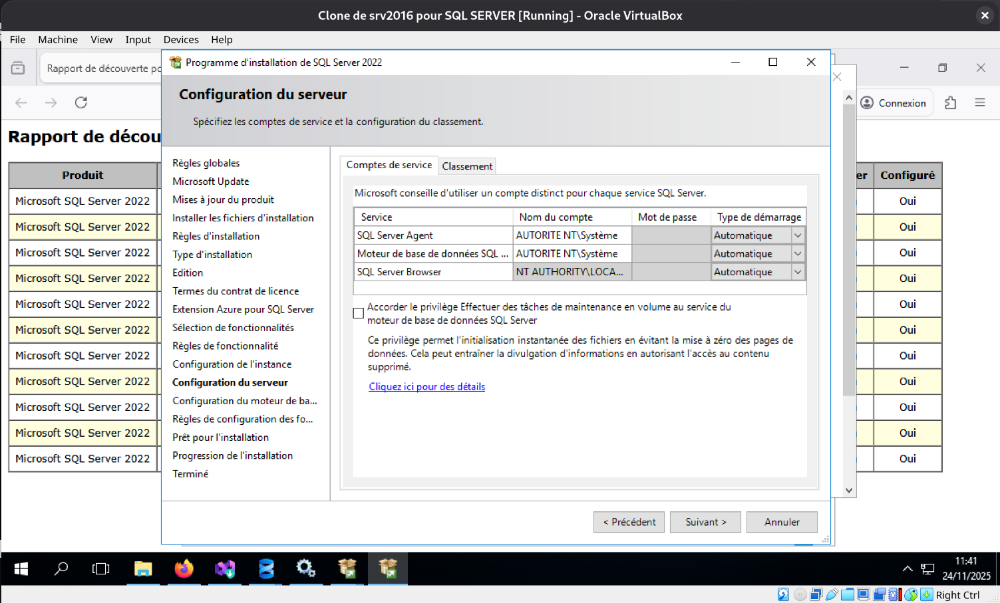
### 2. Configuration du Moteur de Base de Données
Sécurisation de l'accès à l'instance lors de l'installation via l'onglet de configuration du serveur.

- **Mode d'authentification :** Mixte (Authentification Windows et SQL Server).
- **Administrateurs :** Ajout du compte administrateur courant (`SQLMASTER\Admin`) au groupe sysadmin.

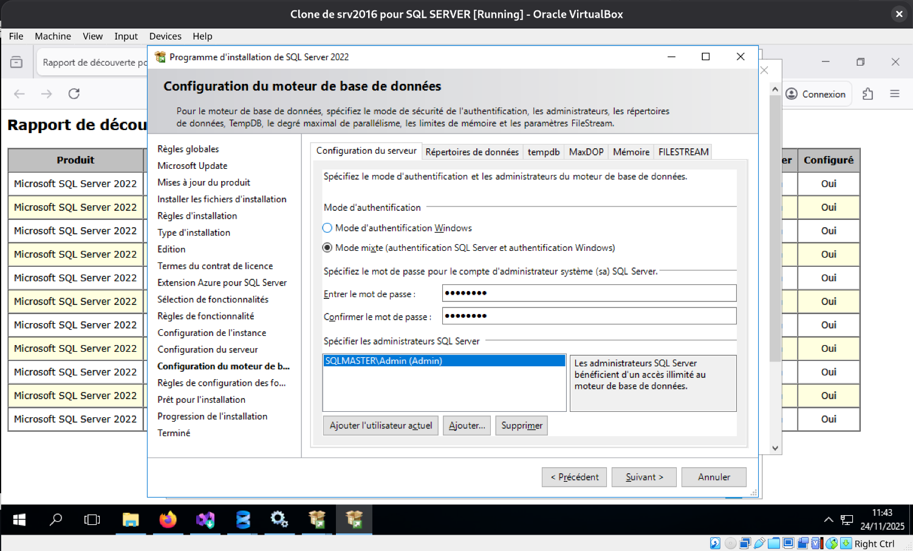
### 3. Validation Post-Installation
Une fois l'installation terminée, nous avons vérifié que les services étaient bien démarrés et que la connexion via SQL Server Management Studio (SSMS) était fonctionnelle.

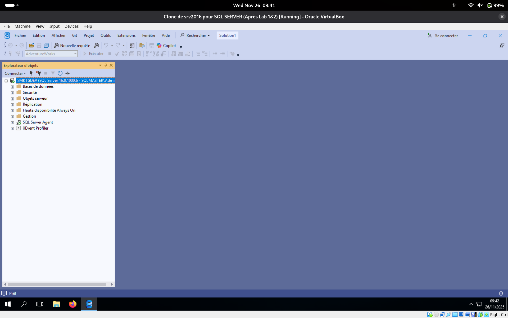

---
## Labo 2 : Création de la base RateTracking

Création d'une base de données multi-fichiers avec répartition sur les disques de données (`MKGTDEV`) et de logs (`MKTGDEV`).

### Script de création
```sql
CREATE DATABASE RateTracking
ON PRIMARY 
( NAME = RateTracking_dat, FILENAME = 'C:\SQLData\MKGTDEV\RateTracking.mdf', ... ),
FILEGROUP USERDATA
( NAME = RateTracking_dat_1, FILENAME = 'C:\SQLData\MKGTDEV\RateTracking_1.ndf', ... ),
...
LOG ON 
( NAME = RateTracking_log, FILENAME = 'C:\SQLLogs\MKTGDEV\RateTracking.ldf', ... );
```

### Validation de l'arborescence

La requête système `sys.database_files` confirme la création des fichiers aux emplacements demandés.

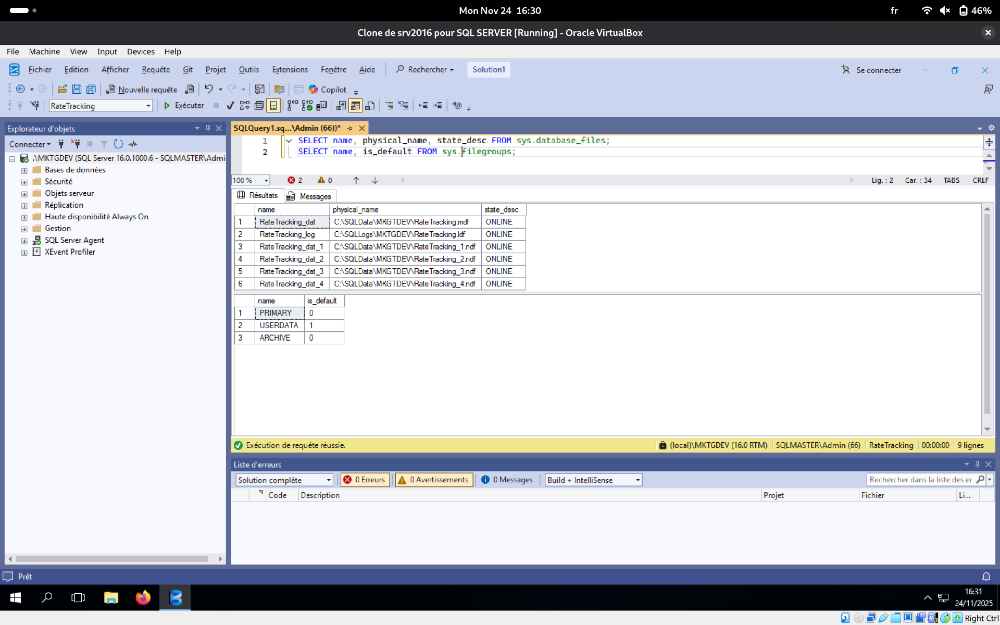

---
## Labo 2' : Optimisation de tempdb

L'objectif était de reparamétrer la base système `tempdb` pour déplacer ses fichiers sur des disques dédiés et améliorer les performances via l'ajout de fichiers secondaires.

### 1. Script de modification
Ce script effectue le déplacement des fichiers existants, le redimensionnement, et la création des nouveaux fichiers `.ndf`.

```sql
USE master;
GO

-- 1. Modification des fichiers existants (Déplacement + Redimensionnement)
ALTER DATABASE tempdb 
MODIFY FILE (NAME = tempdev, FILENAME = 'C:\SQLData\MKGTDEV\tempdb.mdf', SIZE = 30MB, FILEGROWTH = 10MB);
GO

ALTER DATABASE tempdb 
MODIFY FILE (NAME = templog, FILENAME = 'C:\SQLLogs\MKTGDEV\templog.ldf', SIZE = 10MB, FILEGROWTH = 10MB);
GO

-- 2. Ajout des fichiers secondaires
ALTER DATABASE tempdb 
ADD FILE (NAME = tempdev2, FILENAME = 'C:\SQLData\MKGTDEV\tempdb_file2.ndf', SIZE = 20MB, MAXSIZE = UNLIMITED, FILEGROWTH = 10MB);
GO

ALTER DATABASE tempdb 
ADD FILE (NAME = tempdev3, FILENAME = 'C:\SQLData\MKGTDEV\tempdb_file3.ndf', SIZE = 20MB, MAXSIZE = UNLIMITED, FILEGROWTH = 10MB);
GO
````

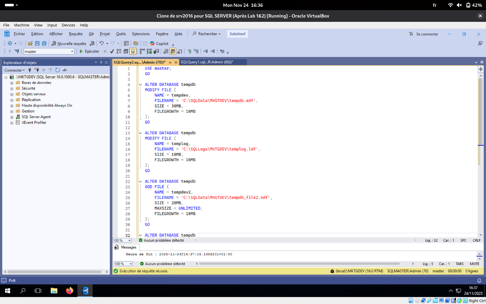
### 2. Vérification après redémarrage

Après redémarrage de l'instance, nous avons validé la nouvelle configuration via la vue système `sys.master_files`.

SQL

```
SELECT name, physical_name, size/128.0 AS MB, state_desc 
FROM sys.master_files 
WHERE database_id = 2;
```

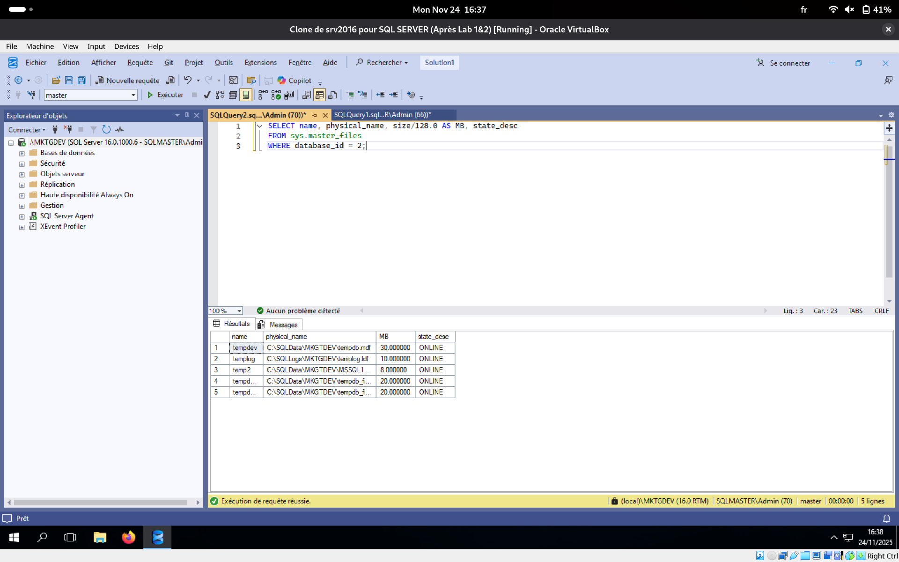

---
## Labo 3 : Sauvegardes et Restauration

### A. Préparation de l'infrastructure (Disque U:)
Conformément au scénario, un nouveau disque de sauvegarde de 10 Go a été ajouté à la machine virtuelle pour simuler un support de stockage dédié.

**1. Ajout du disque virtuel (VDI)**
Création d'un disque dynamique de 10 Go dans VirtualBox.

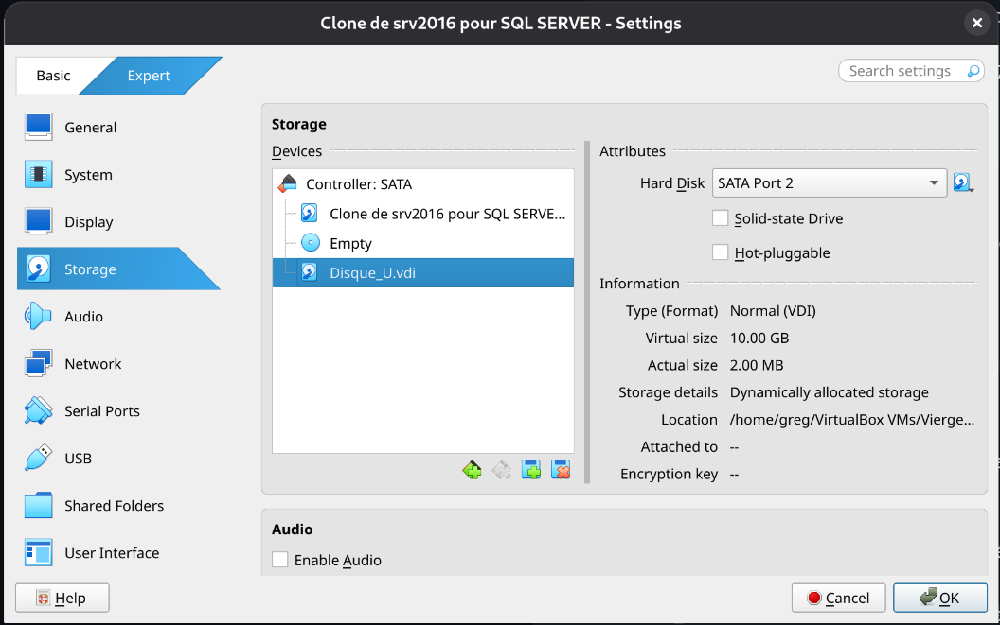

**2. Initialisation sous Windows**
Le disque a été initialisé (GPT) et formaté en NTFS avec la lettre de lecteur `U:`.

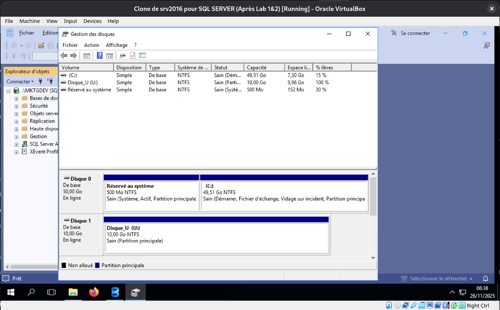

**3. Mise en place du fichier source**
Le fichier `AdventureWorks.bak` fourni par les développeurs et téléchargé via `https://github.com/Microsoft/sql-server-samples/releases/download/adventureworks/AdventureWorks2019.bak`    a été déposé dans le répertoire `U:\BKPMKGTDEV`.

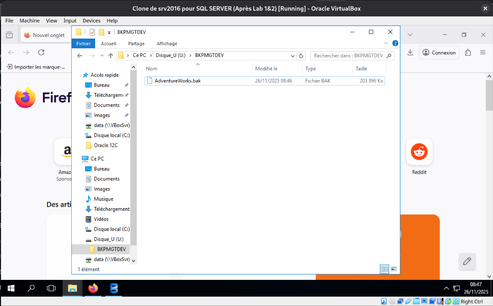

---
### B. Restauration et Comparatif de Compression
Nous avons restauré la base `AdventureWorks` puis réalisé deux sauvegardes (compressée vs non-compressée) pour mesurer le gain d'espace.

**Script utilisé (Restauration + Backup + Comparatif) :**

```sql
USE master;
GO

-- 1. Restauration de la base AdventureWorks (avec déplacement des fichiers)
RESTORE DATABASE AdventureWorks
FROM DISK = 'U:\BKPMKGTDEV\AdventureWorks.bak'
WITH 
    MOVE 'AdventureWorks2019' TO 'C:\SQLData\MKGTDEV\AdventureWorks.mdf',
    MOVE 'AdventureWorks2019_Log' TO 'C:\SQLLogs\MKTGDEV\AdventureWorks.ldf',
    REPLACE, STATS = 10;
GO

-- 2. Sauvegarde SANS compression
BACKUP DATABASE AdventureWorks
TO DISK = 'U:\BKPMKGTDEV\AdventureWorks_NoComp.bak'
WITH NAME = 'Full Backup - No Compression', NO_COMPRESSION, INIT;
GO

-- 3. Sauvegarde AVEC compression
BACKUP DATABASE AdventureWorks
TO DISK = 'U:\BKPMKGTDEV\AdventureWorks_Comp.bak'
WITH NAME = 'Full Backup - Compressed', COMPRESSION, INIT;
GO

-- 4. Analyse des gains
SELECT database_name, type,
    CAST(backup_size / 1024 / 1024 AS DECIMAL(10, 2)) AS [Taille Mo],
    CAST(compressed_backup_size / 1024 / 1024 AS DECIMAL(10, 2)) AS [Taille Compressee Mo],
    CAST((backup_size - compressed_backup_size) / backup_size * 100 AS DECIMAL(5, 2)) AS [Gain %]
FROM msdb.dbo.backupset
WHERE database_name = 'AdventureWorks' AND backup_start_date > DATEADD(minute, -10, GETDATE())
ORDER BY backup_start_date DESC;
GO
```

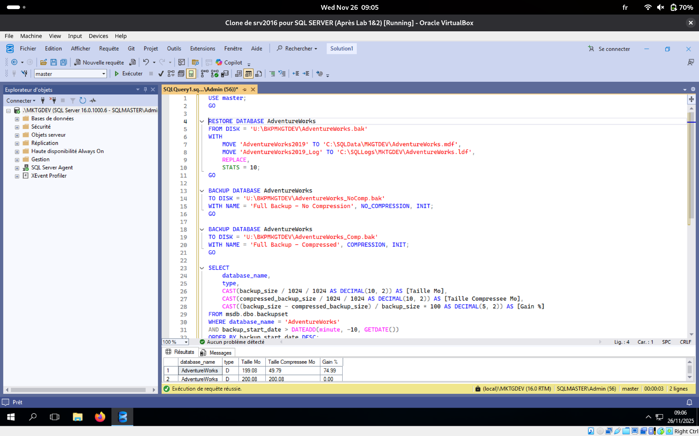

### C. Automatisation des Sauvegardes (Agent SQL)
Mise en place de la stratégie de sauvegarde hebdomadaire via un script générant les Jobs de l'Agent SQL.

**Script de planification (Full Dimanche + Diff Lun/Mer/Ven) :**

```sql
USE msdb;
GO

-- 0. Nettoyage préventif
IF EXISTS (SELECT job_id FROM msdb.dbo.sysjobs WHERE name = 'Backup_AdventureWorks_FULL_Sunday')
    EXEC sp_delete_job @job_name = 'Backup_AdventureWorks_FULL_Sunday';
IF EXISTS (SELECT job_id FROM msdb.dbo.sysjobs WHERE name = 'Backup_AdventureWorks_DIFF_MonWed')
    EXEC sp_delete_job @job_name = 'Backup_AdventureWorks_DIFF_MonWed';
IF EXISTS (SELECT job_id FROM msdb.dbo.sysjobs WHERE name = 'Backup_AdventureWorks_DIFF_Friday')
    EXEC sp_delete_job @job_name = 'Backup_AdventureWorks_DIFF_Friday';
GO

-- 1. Job Full Backup (Dimanche 3h)
EXEC sp_add_job @job_name = 'Backup_AdventureWorks_FULL_Sunday';
EXEC sp_add_jobstep @job_name = 'Backup_AdventureWorks_FULL_Sunday', @step_name = 'Full Backup', @subsystem = 'TSQL', @command = 'BACKUP DATABASE AdventureWorks TO DISK = ''U:\BKPMKGTDEV\AdventureWorks_Sunday.bak'' WITH INIT, COMPRESSION';
EXEC sp_add_schedule @schedule_name = 'Schedule_Sunday_3AM', @freq_type = 8, @freq_interval = 1, @freq_recurrence_factor = 1, @active_start_time = 030000;
EXEC sp_attach_schedule @job_name = 'Backup_AdventureWorks_FULL_Sunday', @schedule_name = 'Schedule_Sunday_3AM';
EXEC sp_add_jobserver @job_name = 'Backup_AdventureWorks_FULL_Sunday';

-- 2. Job Diff Backup (Lundi/Mercredi 5h)
EXEC sp_add_job @job_name = 'Backup_AdventureWorks_DIFF_MonWed';
EXEC sp_add_jobstep @job_name = 'Backup_AdventureWorks_DIFF_MonWed', @step_name = 'Diff Backup', @subsystem = 'TSQL', @command = 'BACKUP DATABASE AdventureWorks TO DISK = ''U:\BKPMKGTDEV\AdventureWorks_Diff.bak'' WITH DIFFERENTIAL, INIT, COMPRESSION';
EXEC sp_add_schedule @schedule_name = 'Schedule_MonWed_5AM', @freq_type = 8, @freq_interval = 10, @freq_recurrence_factor = 1, @active_start_time = 050000;
EXEC sp_attach_schedule @job_name = 'Backup_AdventureWorks_DIFF_MonWed', @schedule_name = 'Schedule_MonWed_5AM';
EXEC sp_add_jobserver @job_name = 'Backup_AdventureWorks_DIFF_MonWed';

-- 3. Job Diff Backup (Vendredi 19h)
EXEC sp_add_job @job_name = 'Backup_AdventureWorks_DIFF_Friday';
EXEC sp_add_jobstep @job_name = 'Backup_AdventureWorks_DIFF_Friday', @step_name = 'Diff Backup Fri', @subsystem = 'TSQL', @command = 'BACKUP DATABASE AdventureWorks TO DISK = ''U:\BKPMKGTDEV\AdventureWorks_Diff_Fri.bak'' WITH DIFFERENTIAL, INIT, COMPRESSION';
EXEC sp_add_schedule @schedule_name = 'Schedule_Friday_7PM', @freq_type = 8, @freq_interval = 32, @freq_recurrence_factor = 1, @active_start_time = 190000;
EXEC sp_attach_schedule @job_name = 'Backup_AdventureWorks_DIFF_Friday', @schedule_name = 'Schedule_Friday_7PM';
EXEC sp_add_jobserver @job_name = 'Backup_AdventureWorks_DIFF_Friday';
GO
```

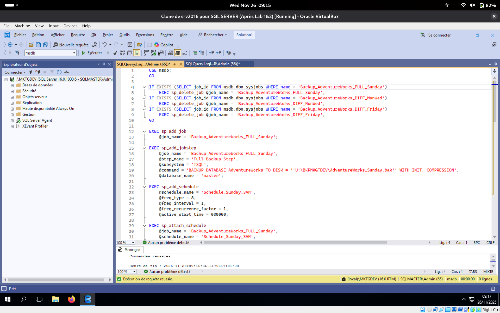

### D. Méthode 2 : Plan de Maintenance
Nous avons également configuré la stratégie de sauvegarde via l'outil graphique **Plan de Maintenance** de SSMS, sans utiliser de script.

**Procédure réalisée :**
1.  Dans l'Explorateur d'objets, déplier le dossier **Gestion**.
2.  Effectuer un **Clic droit** sur **Plans de maintenance** > **Assistant Plan de maintenance**.
3.  Sélectionner les tâches requises :
    *   *Sauvegarder la base de données (complète)*
    *   *Sauvegarder la base de données (différentielle)*
4.  Configurer les tâches pour la base `AdventureWorks` en ciblant le disque de sauvegarde `U:` et en activant la compression.


![[PlanBackup.png]](img/PlanBackup.png)

---
## Labo 4 : Gestion des Utilisateurs et Droits

### 1. Création des utilisateurs Windows (OS)

Les utilisateurs `User1` et `User2` n'existant pas dans l'Active Directory ni sur la VM, ils ont été créés localement via PowerShell en mode Administrateur.

**Commandes exécutées :**

```PowerShell
net user User1 Password123! /add
net user User2 Password123! /add
```

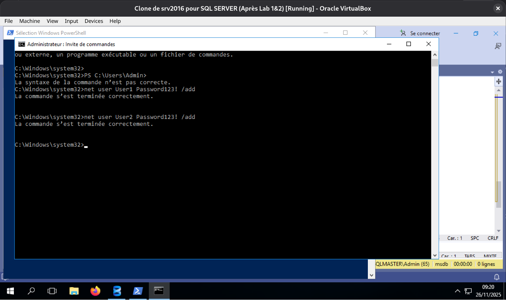
### 2. Configuration SQL Server (Script de Sécurité)

Ce script assure la création des Logins (niveau serveur) et des Utilisateurs (niveau base `AdventureWorks`), ainsi que l'attribution des rôles `db_datareader` et `db_owner`.

**Script de configuration des droits :**

```sql
USE master;
GO
-- Logins SQL et Windows
CREATE LOGIN consult WITH PASSWORD = 'C0nsulT', CHECK_POLICY = OFF;
CREATE LOGIN redact WITH PASSWORD = 'REd@cT', CHECK_POLICY = OFF;

-- Création dynamique des logins pour la machine actuelle
DECLARE @MachineName NVARCHAR(100) = CAST(SERVERPROPERTY('MachineName') AS NVARCHAR(100));
DECLARE @SQL NVARCHAR(MAX);
SET @SQL = 'CREATE LOGIN [' + @MachineName + '\User1] FROM WINDOWS;'; EXEC(@SQL);
SET @SQL = 'CREATE LOGIN [' + @MachineName + '\User2] FROM WINDOWS;'; EXEC(@SQL);
GO

USE AdventureWorks;
GO
-- Utilisateurs et Rôles
CREATE USER consult FOR LOGIN consult;
CREATE USER redact FOR LOGIN redact;

DECLARE @MachineName2 NVARCHAR(100) = CAST(SERVERPROPERTY('MachineName') AS NVARCHAR(100));
DECLARE @SQL_User1 NVARCHAR(MAX);
SET @SQL_User1 = 'CREATE USER [User1] FOR LOGIN [' + @MachineName2 + '\User1];'; EXEC(@SQL_User1);
DECLARE @SQL_User2 NVARCHAR(MAX);
SET @SQL_User2 = 'CREATE USER [User2] FOR LOGIN [' + @MachineName2 + '\User2];'; EXEC(@SQL_User2);

-- Attribution des rôles
ALTER ROLE db_datareader ADD MEMBER consult;
ALTER ROLE db_datareader ADD MEMBER [User1];
ALTER ROLE db_owner ADD MEMBER redact;
ALTER ROLE db_owner ADD MEMBER [User2];
GO
```

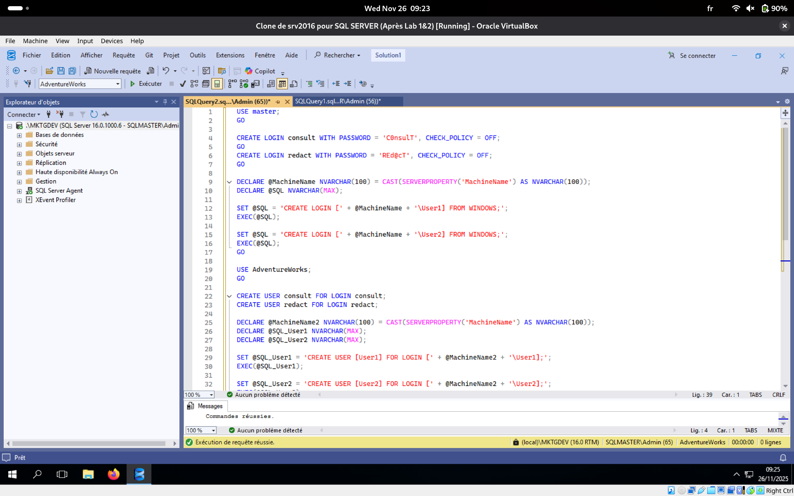
### 3. Validation des accès

**Utilisateurs dans la base `AdventureWorks` :** On constate la présence des 4 utilisateurs configurés (`consult`, `redact`, `User1`, `User2`).

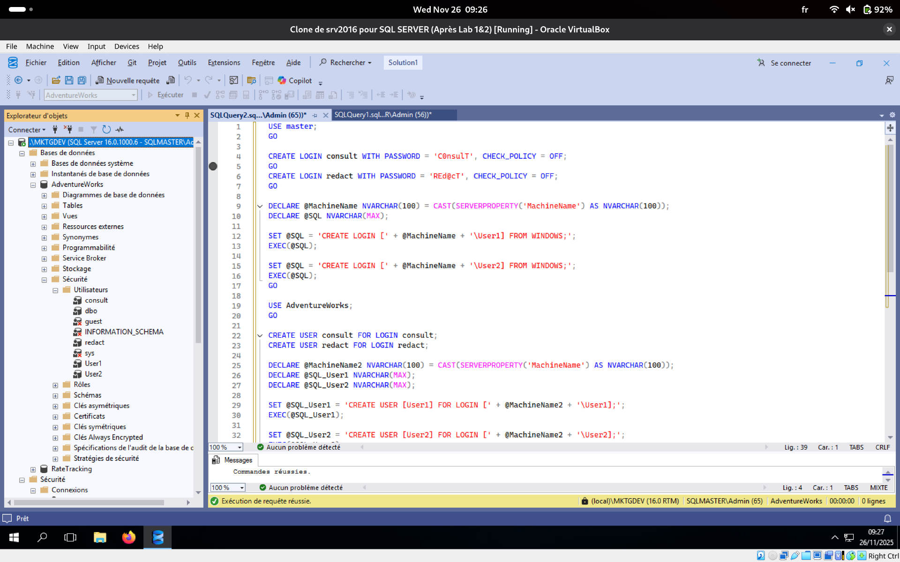

**Vérification sur la base `RateTracking` :** Par défaut, ces utilisateurs n'ont pas été ajoutés à l'autre base `RateTracking`, garantissant le cloisonnement des accès.

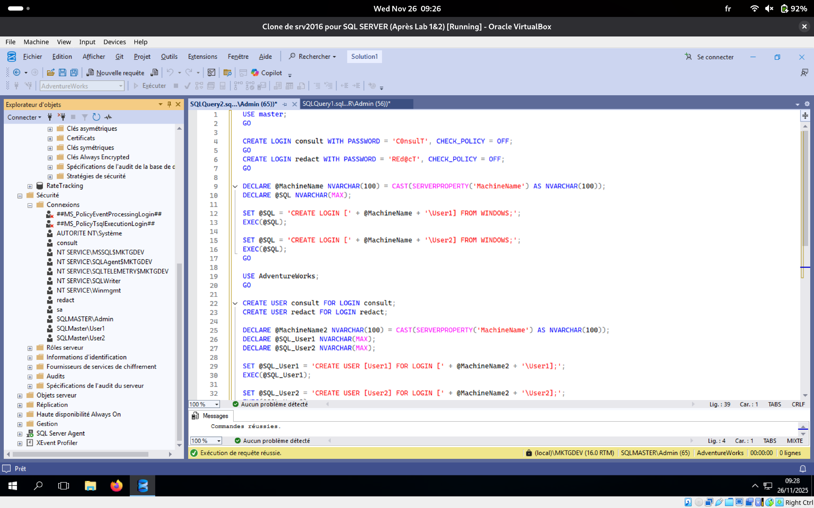
## Conclusion

L'instance `MKTGDEV` est désormais configurée et opérationnelle. De la gestion du stockage physique à l'automatisation des sauvegardes, toutes les étapes critiques de l'administration d'une base de données SQL Server ont été réalisées et validées.
